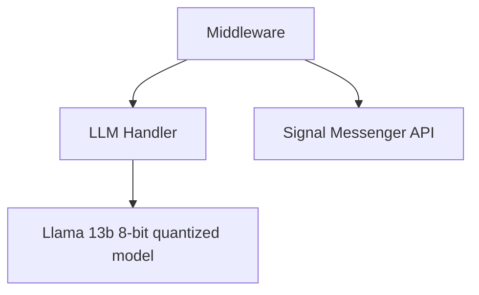

# Vulcan
Making a Signal Messenger-enabled chatbot, powered by LLMs on commodity hardware

### Structure:

At the core of this project are dockerized deployments of the [Signal Messenger API](https://github.com/bbernhard/signal-cli-rest-api), and [Llama.cpp server](https://github.com/abetlen/llama-cpp-python#web-server). The middleware is custom code to glue it all together.

### Chatbot Personality:
The "personality" is defined by prompt injection in the LLM handler file. Currently Vulcan is set to act as a robotic pirate.  

### Can I use this for my own projects?:
Absolutely! You'll probably need to make changes to the configuration though

### Sample Messages:

